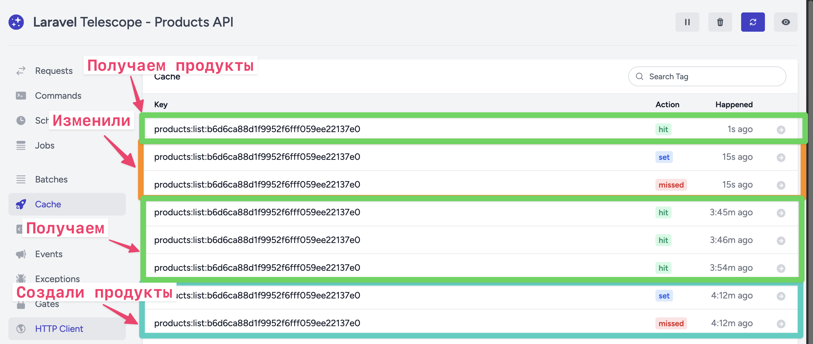

# Products API

Тестовое задание на Laravel: поиск товаров с фильтрами, сортировкой, пагинацией, Docker и Swagger.

Сарыглар Начын

## Запуск через Docker

```bash
cp .env.example .env
docker compose up --build
```

После старта приложение само выполнит миграции и сиды.

Адреса:

- API: `http://localhost:8000/api/products`
- Swagger: `http://localhost:8000/docs`
- OpenAPI JSON: `http://localhost:8000/api/docs`
- Redis на 6379 порту

Сборка OpenAPI доки:
```bash
php artisan l5-swagger:generate
```

Как сделать авторизацию и кинуть запрос в Swagger:
https://cleanshot.com/share/0RNjFQvF

!! Ссылку открывать с VPN

## Примеры запросов

```bash
curl "http://localhost:8000/api/products"
curl "http://localhost:8000/api/products?q=iphone&price_min=500&price_max=1000"
```

## Авторизация

Для `POST`, `PUT`, `DELETE` по товарам нужен Bearer token.

После сидов доступен demo user:

- email: `demo@example.com`
- password: `password`

## Фильтры

- `q` — поиск по подстроке в `name`
- `price_min`, `price_max` — фильтр по цене
- `category_id` — фильтр по категории

## Сортировка

Параметры:

- `sort_field`: `price` или `created_at`
- `sort_type`: `asc` или `desc`

Если сортировка не передана, используется сортировка по новым товарам.

## CRUD endpoints

- `GET /api/products` — список товаров, фильтры, сортировка, пагинация, кэширование
- `POST /api/products` — создание товара, требует авторазции
- `PUT /api/products/{id}` — обновление товара, требует авторазцииen
- `DELETE /api/products/{id}` — удаление товара, требует авторазции

При создании, обновлении и удалении товара кэш списка инвалидируется.

Хит кэша при получении продуктов в телескопе:


## Тесты

```bash
php artisan test
```
